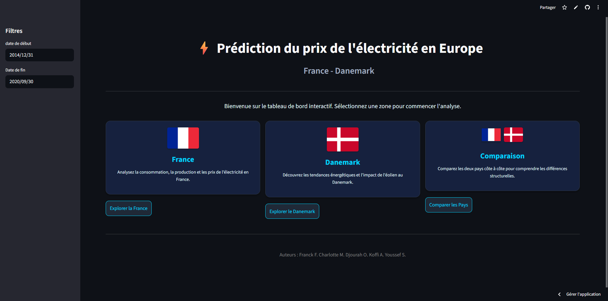

# ⚡ Prédiction & Analyse du Prix de l'Électricité en Europe




---

## 📖 À propos du projet

Ce projet vise à **prédire et analyser les prix "day-ahead" de l'électricité en Europe** (avec un focus sur la France et le Danemark) sur la période critique **2020-2025**. Cette période inclut des dynamiques de marché complexes : stabilité initiale, choc de la crise COVID-19, et crise énergétique majeure de 2022.

L'objectif est double :
1.  **Modéliser** les prix futurs grâce à des algorithmes de Machine Learning (LightGBM) et de séries temporelles (SARIMAX).
2.  **Visualiser et Expliquer** les dynamiques de marché via un Dashboard interactif complet.

---

## 🚀 Fonctionnalités Clés

### 📊 Dashboard Interactif (Streamlit)
Une application web complète pour explorer les données et les modèles :
*   **Vue d'Ensemble** : Métriques clés (Prix moyen, Volatilité) par période.
*   **Analyse EDA** : Distribution des prix, saisonnalités, détection d'outliers.
*   **Mix Énergétique** : Impact des énergies renouvelables vs fossiles.
*   **Performance Modèles** : Comparaison Visuelle (Réel vs Prédictions) et métriques (MAE/RMSE).
*   **Analyse de Volatilité** : Graphiques "Crosse de Hockey" (Merit Order) et analyse SHAP.

### 🧠 Pipeline Machine Learning
*   **Feature Engineering avancé** :
    *   Variables temporelles (Saisons, Heures, Jours fériés).
    *   Lag Features (Prix passés à 1h, 24h, 168h) pour capturer l'inertie.
    *   Rolling Statistics (Moyennes mobiles, volatilité glissante).
*   **Modèles Comparés** :
    *   **LightGBM** (Gradient Boosting) : Excellent pour capturer les non-linéarités complexes.
    *   **SARIMAX** : Référence statistique pour les séries temporelles.

---

## 📂 Structure du Projet

```text
electricite-prediction-europe/
│
├── 📊 dashboard/                 # Application Streamlit
│   ├── app.py                    # Point d'entrée principal
│   ├── views/                    # Pages du dashboard (France, Danemark, Comparaison)
│   ├── Analyse/                  # Modules d'analyse métier (Logique EDA, ML)
│   └── asset/                    # Ressources statiques (Images, Drapeaux)
│
├── 📓 notebooks/                 # Labo de Data Science
│   └── France/                   # Modélisation Focus France
│       ├── France_2020_2025_EDA.ipynb        # Exploration & Nettoyage
│       ├── France_2020_2025_Features.ipynb   # Feature Engineering (Lags, Rolling stats)
│       └── France_2020_2025_Modeling.ipynb   # Entraînement & Validation (LightGBM/SARIMAX)
│
├── 🛠 src/                       # Scripts utilitaires
│   └── data_downloader.py        # Script de téléchargement des données OPSD
│
├── 💾 data/
│   ├── raw/                      # Données brutes (ENTSO-E/OPSD)
│   └── processed/                # Données nettoyées (Parquet/CSV)
│
├── 📦 models/                    # Modèles ML sérialisés (.pkl)
│
├── 📄 rapports/                  # Documentation & Slides
│   └── Projet1-DataBI.pdf        # Présentation du projet
│
└── requirements.txt              # Dépendances du projet
```

---

## 🛠 Installation et Utilisation

### 1. Cloner et Installer
Assurez-vous d'avoir **Python 3.10+**.

```bash
# Créer un environnement virtuel
python -m venv .venv

# Activer l'environnement (Windows)
.venv\Scripts\Activate.ps1

# Installer les dépendances
pip install -r requirements.txt
```

### 2. Lancer le Dashboard
Pour explorer les résultats via l'interface interactive :

```bash
cd dashboard
streamlit run app.py
```

### 3. Ré-entraîner les modèles (Optionnel)
Si vous souhaitez régénérer les modèles :
1.  Lancer `notebooks/France/France_2020_2025_EDA.ipynb`
2.  Lancer `notebooks/France/France_2020_2025_Features.ipynb`
3.  Lancer `notebooks/France/France_2020_2025_Modeling.ipynb`

---

## 📈 Résultats et Insights

*   **Robustesse** : Le modèle **LightGBM Optimisé** atteint une MAE (Erreur Absolue Moyenne) très faible d'environ **0.85 €/MWh** sur le test set (hors crise extrême), surpassant largement les modèles statistiques classiques.
*   **Interprétabilité** : L'analyse **SHAP** confirme que les prix passés (J-1) et le prix des combustibles (Gaz/CO2) sont les déterminants majeurs du prix de l'électricité.
*   **Merit Order** : L'analyse de volatilité met clairement en évidence l'effet de seuil ("Crosse de Hockey") où les prix explosent exponentiellement lorsque la demande dépasse les capacités de base (Nucléaire/Renouvelable).

---

## Licence

MIT
